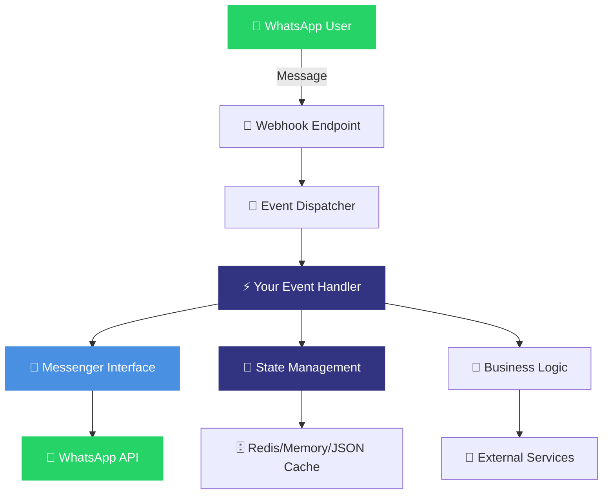

# Wappa 🤖

**Open Source Framework for WhatsApp Business Applications**

Build intelligent WhatsApp bots, workflows, and chat applications with clean architecture and modern Python.

[](https://www.python.org/downloads/)
[](https://opensource.org/licenses/Apache-2.0)
[](https://fastapi.tiangolo.com)
[](https://developers.facebook.com/docs/whatsapp)

---

## 🚀 What is Wappa?

Wappa is a modern Python framework that transforms WhatsApp Business API into a powerful platform for building:

- **🤖 Smart Chatbots** - AI-powered conversational experiences
- **📋 Workflows** - Multi-step business processes  
- **🎯 Agents** - Intelligent customer service automation
- **💬 Chat Applications** - Full-featured messaging platforms

**Built for developers who want clean code, not webhook complexity.**

## ✨ Key Features

### 🎯 **Simple & Clean**
```python
from wappa import Wappa, WappaEventHandler

class MyBot(WappaEventHandler):
    async def process_message(self, webhook):
        await self.messenger.send_text("Hello!", webhook.user.user_id)

app = Wappa()
app.set_event_handler(MyBot())
app.run()
```

### 🏗️ **Production-Ready Architecture**
- **Clean Architecture** - Domain-driven design with dependency injection
- **Type-Safe** - Full Pydantic models for all WhatsApp data structures
- **Multi-Tenant** - Built for scaling across multiple business numbers
- **Plugin System** - Extensible with Redis, CORS, rate limiting, and custom plugins

### 📱 **Complete WhatsApp Support**
- **All Message Types** - Text, media, interactive buttons, lists, templates
- **Rich Interactions** - Buttons, lists, call-to-action messages
- **Media Handling** - Images, videos, audio, documents with automatic upload/download
- **Templates** - Pre-approved business message templates

### 🛠️ **Developer Experience**
```bash
# Initialize new project
wappa init my-bot

# Start development server with auto-reload
wappa dev app/main.py

# Browse interactive examples
wappa examples
```

### 💾 **Flexible State Management**
```python
# Memory, JSON file, or Redis caching
app = Wappa(cache="redis")  # or "memory" or "json"

# Automatic state persistence
await self.state_cache.set("conversation", {"step": "greeting"})
```

## 📦 Installation

### Using uv (Recommended)
```bash
# Create new project
uv init my-wappa-project
cd my-wappa-project

# Add Wappa
uv add wappa

# Initialize project structure
wappa init .
```

### Using pip
```bash
pip install wappa

# Initialize new project
wappa init my-wappa-project
cd my-wappa-project
```

### Using Poetry
```bash
poetry new my-wappa-project
cd my-wappa-project
poetry add wappa

# Initialize project structure  
wappa init .
```

## 🏃‍♂️ Quick Start

### 1. Get WhatsApp Business API Credentials

1. Visit [Meta for Developers](https://developers.facebook.com)
2. Create a WhatsApp Business App
3. Get your credentials:
   - **Access Token**
   - **Phone Number ID** 
   - **Business Account ID**

### 2. Create Your Bot

```bash
# Initialize project
wappa init my-bot
cd my-bot

# Configure environment
cp .env.example .env
# Edit .env with your WhatsApp credentials
```

### 3. Run Development Server

```bash
# Start with auto-reload
wappa dev app/main.py

# Or manually
uv run python -m app.main
```

### 4. Test Your Bot

Send a message to your WhatsApp Business number and watch it echo back!

## 🎛️ Architecture Overview



- **Event-Driven**: Webhook → Event Handler → Response
- **Type-Safe**: Full Pydantic models for all WhatsApp data structures  
- **FastAPI Core**: Built on modern async Python with automatic OpenAPI docs
- **Production Ready**: Docker support, Redis caching, structured logging

## 📚 Documentation

**📖 [Complete Documentation](https://wappa.mimeia.com/docs)**

### Quick Links

- **🚀 [Quick Start](https://wappa.mimeia.com/docs/getting-started)** - Get running in 5 minutes
- **🏗️ [Architecture Guide](https://wappa.mimeia.com/docs/concepts/architecture)** - Understanding the framework
- **📡 [API Reference](https://wappa.mimeia.com/docs/api/messaging)** - Complete messaging API
- **💾 [State Management](https://wappa.mimeia.com/docs/concepts/state-management)** - Caching and persistence
- **🚀 [Deploy to Railway](https://wappa.mimeia.com/docs/deployment/railway)** - Production deployment
- **🛠️ [WhatsApp Setup](https://wappa.mimeia.com/docs/setup/whatsapp-setup)** - Configure WhatsApp Business API

### Example Projects

Explore 6 complete example applications:

```bash
# Browse examples interactively
wappa examples

# Copy specific example
wappa examples redis-cache-demo
```

- **Simple Echo** - Basic message echoing
- **JSON Cache Demo** - File-based state persistence
- **Redis Cache Demo** - High-performance caching
- **OpenAI Transcription** - Voice message processing
- **Full-Featured Bot** - Complete production example
- **Basic Project** - Minimal setup template

## 🛠️ Advanced Usage

### Builder Pattern for Complex Apps

```python
from wappa import WappaBuilder

app = await (WappaBuilder()
             .with_whatsapp(
                 token="your_token",
                 phone_id="your_phone_id", 
                 business_id="your_business_id"
             )
             .with_redis_cache("redis://localhost:6379")
             .with_cors_enabled()
             .with_rate_limiting(requests_per_minute=100)
             .build())

app.set_event_handler(MyAdvancedHandler())
app.run()
```

### Plugin System

```python
from wappa.plugins import DatabasePlugin, CorsPlugin

app = Wappa(cache="redis")
app.add_plugin(DatabasePlugin("postgresql://..."))
app.add_plugin(CorsPlugin(allow_origins=["*"]))
app.set_event_handler(MyHandler())
app.run()
```

### CLI Commands

```bash
# Project management
wappa init [directory]          # Initialize new project
wappa examples [target]         # Browse/copy examples

# Development
wappa dev app/main.py           # Development server with auto-reload
wappa prod app/main.py          # Production server

# Help
wappa --help                    # Show all commands
```

## 🚀 Deployment

### Railway (Recommended)

```bash
# Install Railway CLI
npm install -g @railway/cli

# Login and deploy
railway login
railway init
railway add redis
railway up

# Set environment variables
railway variables set WP_ACCESS_TOKEN=your_token
railway variables set WP_PHONE_ID=your_phone_id
railway variables set WP_BID=your_business_id
```

See [complete Railway deployment guide](https://wappa.mimeia.com/docs/deployment/railway).

### Docker

```dockerfile
FROM python:3.12-slim

WORKDIR /app
COPY . .

RUN pip install uv
RUN uv sync --frozen

EXPOSE 8000
CMD ["uv", "run", "python", "-m", "app.main"]
```

## 🧪 Development

### Setup Development Environment

```bash
# Clone repository
git clone https://github.com/sashanclrp/wappa.git
cd wappa

# Install dependencies
uv sync --group dev

# Run tests
uv run pytest

# Code formatting
uv run ruff check .
uv run ruff format .
```

### Project Structure

```
wappa/
├── wappa/                  # Core framework
│   ├── core/              # Application core & plugins
│   ├── messaging/         # WhatsApp messaging implementation
│   ├── persistence/       # Cache backends (Memory/JSON/Redis)
│   ├── cli/               # CLI tools & project templates
│   └── api/               # FastAPI routes & dependencies
├── examples/              # Example applications
├── docs/                  # Documentation source
└── tests/                # Test suite
```

## 🤝 Community & Support

### 💬 **Join the Community**
- **💭 [Discord Community](https://discord.gg/wappa)** - Get help, share projects, and connect with other developers
- **🐛 [GitHub Issues](https://github.com/sashanclrp/wappa/issues)** - Bug reports and feature requests
- **📖 [GitHub Discussions](https://github.com/sashanclrp/wappa/discussions)** - Questions and community discussions

### 📞 **Get Support**
- **📚 [Documentation](https://wappa.mimeia.com/docs)** - Comprehensive guides and API reference
- **💡 [Examples](https://wappa.mimeia.com/docs/resources/examples)** - 6 complete working examples
- **🔧 [Configuration Guide](https://wappa.mimeia.com/docs/setup/whatsapp-setup)** - WhatsApp Business API setup

### 🤝 **Contributing**
We welcome contributions! Please see our [Contributing Guide](CONTRIBUTING.md) for details.

- **🐛 Found a bug?** Open an [issue](https://github.com/sashanclrp/wappa/issues)
- **💡 Have an idea?** Start a [discussion](https://github.com/sashanclrp/wappa/discussions)
- **🔧 Want to contribute?** Check out [good first issues](https://github.com/sashanclrp/wappa/labels/good%20first%20issue)

## 📋 Requirements

- **Python 3.12+** - Modern Python with latest type hints
- **WhatsApp Business API** - Meta for Developers account
- **Redis** (optional) - For production caching and state management

## 📄 License

This project is licensed under the Apache License 2.0 - see the [LICENSE](LICENSE) file for details.

## 🙏 Acknowledgments

- **Meta** - For the WhatsApp Business API
- **FastAPI** - For the excellent async Python framework
- **Redis** - For high-performance caching
- **Open Source Community** - For inspiration and contributions

---

**Built with ❤️ by [Mimeia](https://mimeia.com) • Open Source • Apache 2.0 License**

*Transform your business communication with WhatsApp automation.*